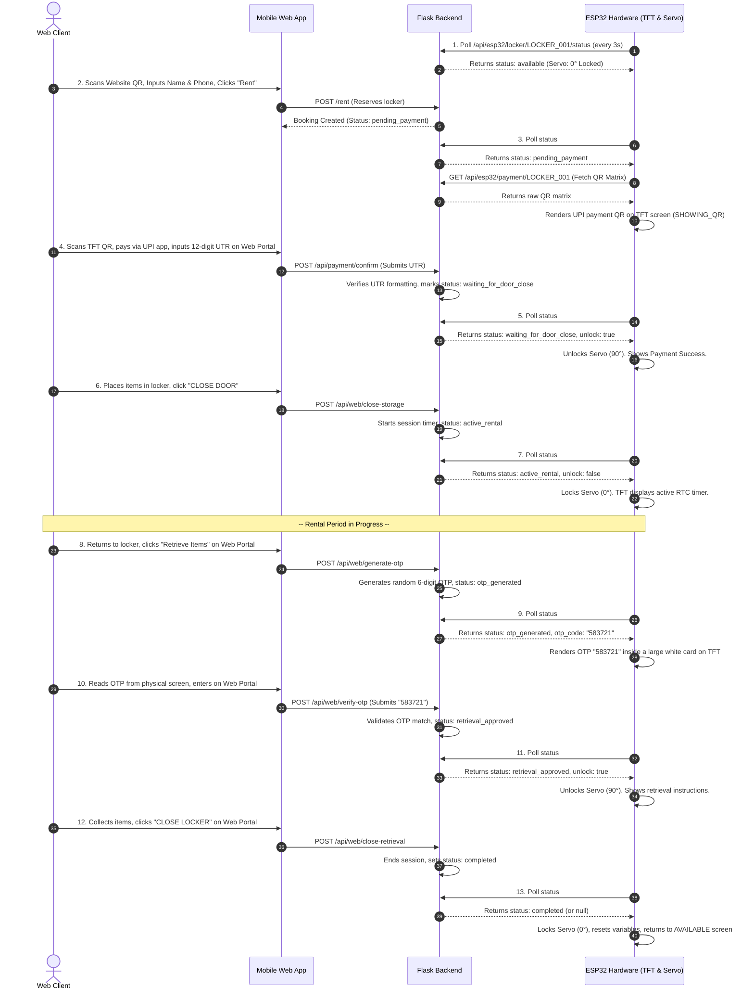

# IoT-Based Smart Rental Locker System — Complete Project Manual & Reference Guide

This document serves as the complete technical manual and design specification for the **IoT-Based Smart Rental Locker System** prototype. It covers system architecture, hardware connections, software methodologies, database structures, web styling specifications, and APIs.

---

## 1. System Architecture & Working Explanation

The Smart Rental Locker System operates on a **state-driven client-server architecture** designed to bridge physical storage lockers with a web-based client portal and automated backend. The system coordinates the physical lock's locking and unlocking actions via local Wi-Fi communication without dependencies on external cellular networks or SMS gateways.

### Component Layers
1. **Physical Client (ESP32 DevKit V1)**: Coordinates the local displays, clock, and lock. It continuously polls the Flask backend server via HTTP GET requests every 3 seconds to check the current booking status.
2. **Backend Server (Flask & SQLite)**: Runs a local Python web server that handles HTTP requests, serves the front-end web app pages, manages booking states, and writes transactions to a relational SQLite database (`locker.db`).
3. **Web User Interface**: A responsive, mobile-friendly web page accessed by customers to browse available lockers, enter booking details, submit payment reference numbers (UTR), and verify retrieval OTPs.
4. **Physical Feedback**:
   * **ILI9341 2.4" TFT screen**: Displays boot info, renting instructions, payment QR codes, active rental timers, and retrieval OTP codes.
   * **SG90 Micro Servo**: Operates the locker's physical latch mechanism.
   * **DS3231 RTC module**: Maintains real-time tracking for accurate session timings.

---

### Step-by-Step Functional Workflow

---

## 2. Full Circuit Design & Hardware Connections

The circuit integrates an **ESP32 NodeMCU board**, an **ILI9341 SPI TFT screen**, an **SG90 analog servo motor**, and a **DS3231 RTC module**.

### Complete Pinout Connection Table

| Component | Pin Label | ESP32 GPIO | Connection Description | Recommended Cable Color |
| :--- | :--- | :--- | :--- | :--- |
| **ILI9341 2.4" TFT** | VCC | 3V3 / 5V | Power Supply (Typically 3.3V or 5V depending on board design) | Red |
| | GND | GND | Common Ground Reference | Black |
| | CS | GPIO 15 | Chip Select (Active Low SPI line) | Orange |
| | RESET | GPIO 4 | Hardware Reset line | Yellow |
| | D/C (RS) | GPIO 2 | Data / Command Control line | Green |
| | MOSI (SDI) | GPIO 23 | SPI Data input line | Blue |
| | SCK (CLK) | GPIO 18 | SPI Clock line | Purple |
| | LED | 3V3 | Backlight Power Supply (via 100-ohm current-limiting resistor) | White |
| **SG90 Servo Motor** | Signal (PWM)| GPIO 13 | 50Hz PWM Signal control line | Yellow / Orange |
| | VCC | Vin (5V) | Dedicated 5V operating power line (directly from USB input) | Red |
| | GND | GND | Common Ground Reference | Brown |
| **DS3231 RTC Module** | SDA | GPIO 21 | I2C Data Line | Green |
| | SCL | GPIO 22 | I2C Clock Line | Yellow |
| | VCC | 3V3 | Power Supply | Red |
| | GND | GND | Common Ground Reference | Black |

### Datasheet and Electrical Specifications

1. **ESP32 NodeMCU LX6**:
   * **Logic Level**: 3.3V digital logic. Maximum current rating per GPIO pin is 12mA.
   * **Regulator**: Has an onboard Low Dropout (LDO) regulator that steps down 5V (USB input) to 3.3V for internal rails.
2. **ILI9341 2.4" TFT display**:
   * **Resolution**: 320x240 pixels (RGB).
   * **Communication**: Driven via Hardware SPI (`SPI_FREQUENCY = 40000000` / 40 MHz).
   * **Backlight**: Draws ~20mA. Driven from the 3.3V line through a 100-ohm resistor.
3. **SG90 Micro Servo**:
   * **Torque**: 1.8 kg-cm at 4.8V.
   * **Voltage**: 4.8V to 6V. 
   * **Safety Note**: Powered via the 5V **Vin** pin rather than the 3.3V pin. Drawing active current from the 3.3V regulator rail will trigger an ESP32 brown-out reset due to high inductive startup currents.
4. **DS3231 RTC Module**:
   * **Timekeeping Accuracy**: ±2ppm (parts per million), maintaining time within ±0.17 seconds per day.
   * **Communication**: Driven via I2C at 400kHz.

---

## 3. Database Schema (SQLite)

The relational schema is configured to run locally inside `locker.db` with the following entities:

### 1. `users`
Tracks user access credentials and profile states.
* `user_id` (INTEGER PRIMARY KEY AUTOINCREMENT)
* `phone_number` (TEXT UNIQUE NOT NULL)
* `password_hash` (TEXT NOT NULL)
* `full_name` (TEXT NOT NULL)
* `created_at` (TIMESTAMP DEFAULT CURRENT_TIMESTAMP)

### 2. `lockers`
Stores physical locker terminal meta and locks status.
* `locker_id` (TEXT PRIMARY KEY) - Seeded as `LOCKER_001`
* `status` (TEXT DEFAULT 'available') - Values: `available`, `occupied`, `maintenance`
* `last_heartbeat` (TIMESTAMP)

### 3. `bookings`
Tracks active, pending, and completed locker rentals.
* `booking_id` (INTEGER PRIMARY KEY AUTOINCREMENT)
* `user_id` (INTEGER NOT NULL)
* `locker_id` (TEXT NOT NULL)
* `booking_status` (TEXT NOT NULL) - Values: `pending_payment`, `waiting_for_door_close`, `active_rental`, `otp_generated`, `retrieval_approved`, `completed`, `expired`, `cancelled`
* `start_time` (TIMESTAMP)
* `end_time` (TIMESTAMP)
* `duration_mins` (INTEGER DEFAULT 60)
* `created_at` (TIMESTAMP DEFAULT CURRENT_TIMESTAMP)

### 4. `payments`
Tracks UPI verification reference logs.
* `payment_id` (INTEGER PRIMARY KEY AUTOINCREMENT)
* `booking_id` (INTEGER NOT NULL)
* `amount` (REAL NOT NULL)
* `payment_status` (TEXT DEFAULT 'pending') - Values: `pending`, `completed`, `failed`
* `utr_ref` (TEXT UNIQUE) - 12-digit transaction number
* `created_at` (TIMESTAMP DEFAULT CURRENT_TIMESTAMP)

### 5. `otps`
Stores dynamic out-of-band retrieval passwords.
* `otp_id` (INTEGER PRIMARY KEY AUTOINCREMENT)
* `booking_id` (INTEGER NOT NULL)
* `phone_number` (TEXT NOT NULL)
* `otp_code` (TEXT NOT NULL) - 6-digit numeric string
* `created_at` (TIMESTAMP DEFAULT CURRENT_TIMESTAMP)
* `expires_at` (TIMESTAMP NOT NULL)
* `used` (INTEGER DEFAULT 0 CHECK (used IN (0, 1)))

---

## 4. Software State Machine Transitions (Matrix)

The ESP32 firmware functions as a state machine governed by the backend database status returned during HTTP polling.

| ID | Backend Status | TFT Screen Mode | Servo Angle | Transition Trigger | Next State |
| :--- | :--- | :--- | :--- | :--- | :--- |
| **1** | `null` / `available` | Displays website URL & locker ID ("AVAILABLE") | 0° (Locked) | User submits booking form on mobile portal | **2. Pending Payment** |
| **2** | `pending_payment` | Displays QR Code matrix (UPI payload) | 0° (Locked) | User submits 12-digit UTR and server confirms | **3. Waiting Close** |
| **3** | `waiting_for_door_close` | "Payment Success! Open / Store Items" | 90° (Unlocked) | User places items in locker and clicks "CLOSE DOOR" | **4. Active Rental** |
| **4** | `active_rental` | Displays ticking hours/minutes/seconds countdown | 0° (Locked) | User returns to locker and clicks "Retrieve Items" | **5. OTP Generated** |
| **5** | `otp_generated` | Renders a large centered card displaying a 6-digit OTP | 0° (Locked) | User enters the correct 6-digit OTP on the mobile web portal | **6. Retrieval Approved** |
| **6** | `retrieval_approved` | "OTP Verified! Open / Collect Items" | 90° (Unlocked) | User collects items and clicks "CLOSE LOCKER" | **7. Idle (Available)** |

---

## 5. Web UI Design & Aesthetics

The customer web portal features a **premium monochromatic black-and-white theme**:
1. **Background**: Pure black (`#000000`) body background.
2. **Cards**: Very dark charcoal cards (`#0c0c0e`) with high-contrast pure white borders (`#ffffff`) and white text.
3. **Forms & Inputs**: Input fields (such as Full Name, Phone Number, UTR, and OTP) feature a clean white background (`#ffffff`) with black text (`#000000`) to match modern laptop and mobile UI styling.
4. **Locker Grid**: Locker choice buttons are styled with a dark background (`#121212`) and zinc-gray borders (`#3f3f46`). When selected, they invert to a white background (`#ffffff`) with black text (`#000000`).
5. **Action Buttons**: Form submission buttons use a clean white background with bold black text.
6. **No Redirect Buttons**: Paytm, Google Pay, PhonePe, and payment card buttons are completely removed from the billing page to match the local verification flow (relying solely on the physical TFT screen scanning and manual UTR verification).
7. **Cancel Actions**: Red warning borders (`#ef4444`) with high-contrast text are applied on cancellation elements, changing to solid red on hover.

---

## 6. API Routing Reference

### A. Web Portal Routes
* `GET /`: Serves the homepage / locker rental booking screen.
* `GET /payment/<booking_id>`: Serves the payment page (showing QR code guidelines and UTR form).
* `GET /retrieve/<booking_id>`: Serves the item collection page (allows requesting OTP and verifying it).
* `GET /admin`: Serves the admin management dashboard (requires Basic Authentication).

### B. REST API Endpoint Routes
* `POST /api/web/rent`: Reserves a locker and initializes the session.
* `POST /api/payment/confirm`: Verifies a submitted 12-digit transaction UTR to update state.
* `GET /api/payment/check-status/<booking_id>`: Returns whether the locker has transitioned past payment.
* `POST /api/web/close-storage`: Locks the servo after item insertion, starting the session.
* `POST /api/web/generate-otp`: Triggers backend OTP generation and updates state.
* `POST /api/web/verify-otp`: Validates the user's inputted OTP.
* `POST /api/web/close-retrieval`: Finishes the session, releasing the locker back to `available`.

### C. ESP32 Interface Routes
* `GET /api/esp32/locker/<locker_id>/status`: Returns JSON status object containing state flags, timers, and OTP codes.
* `GET /api/esp32/payment/<locker_id>`: Returns a raw 2D pixel array representing the UPI QR code matrix.
* `POST /api/esp32/heartbeat`: Receives status metrics and RSSI from the microcontroller.

---

## 7. Key Project Presentation Security Decisions

When presenting the prototype system, keep these architectural security decisions in mind:
1. **Free TFT-Based OTP Factor**: Traditional systems using SMS gateways (Twilio, MSG91) face gateway fees, delivery latency, and telecom compliance. Displaying the retrieval OTP on the physical TFT display proves the user is physically present at the locker terminal, acting as a free, highly secure out-of-band proof-of-presence factor.
2. **Servo Power Protection**: The SG90 analog servo requires constant active PWM control signals to turn. In the event of a total power loss or microcontroller crash, the motor locks into its active position, preventing unauthorized lock release.
3. **SQLite Local Ledger**: A single-file SQLite database keeps the backend lightweight, highly portable, and self-contained, removing dependencies on heavy external database engines (like MySQL or PostgreSQL) for prototyping.
